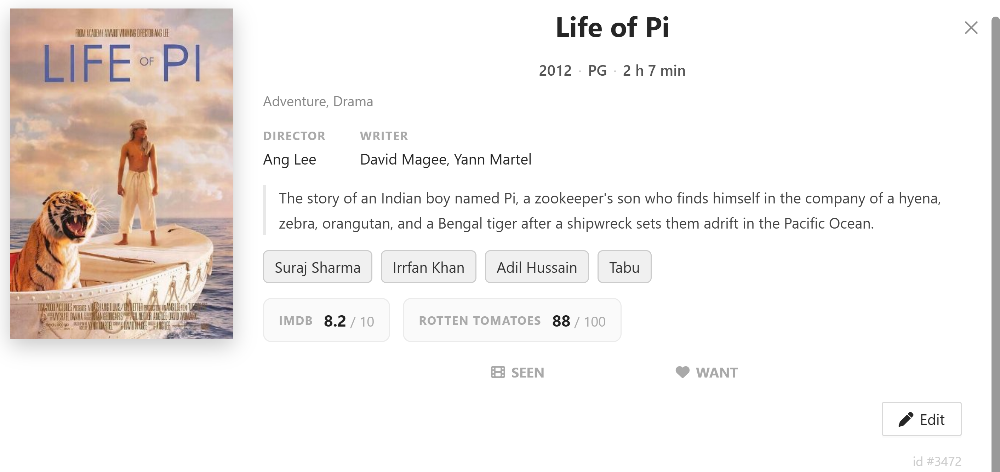
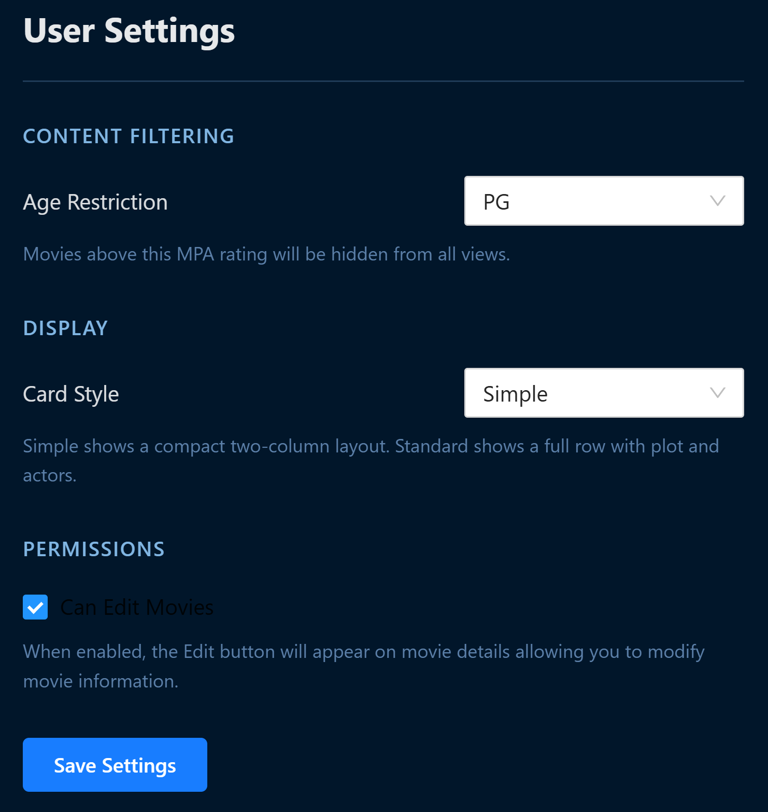
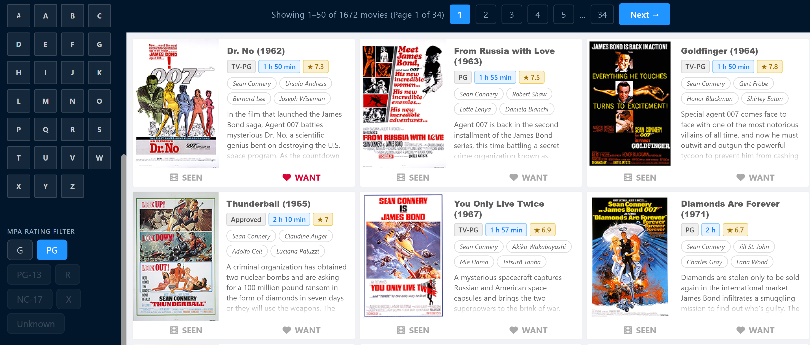

3/24-30/2026

### Commits:
- Added “Edit” movie button to movie cards
  - Updated settings to allow users to enable editing permissions > disabled for now
  - Multiple fields can be edited at once and displayed immediately (no need to refresh)
- Added “MPA Rating Filter” button to search area
  - Displayed in alphabetical order (Simple title)
  - Accounted for Age Restriction settings
  - Displays 50 movies per page, with “next” / “previous” buttons at the top and bottom of the page

