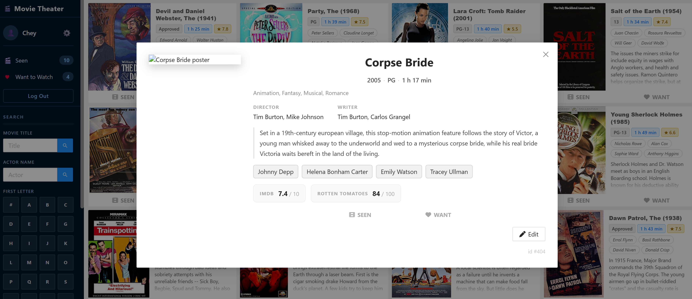
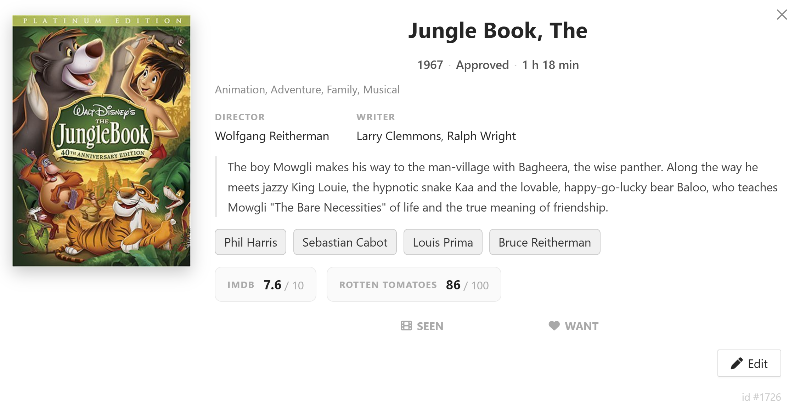
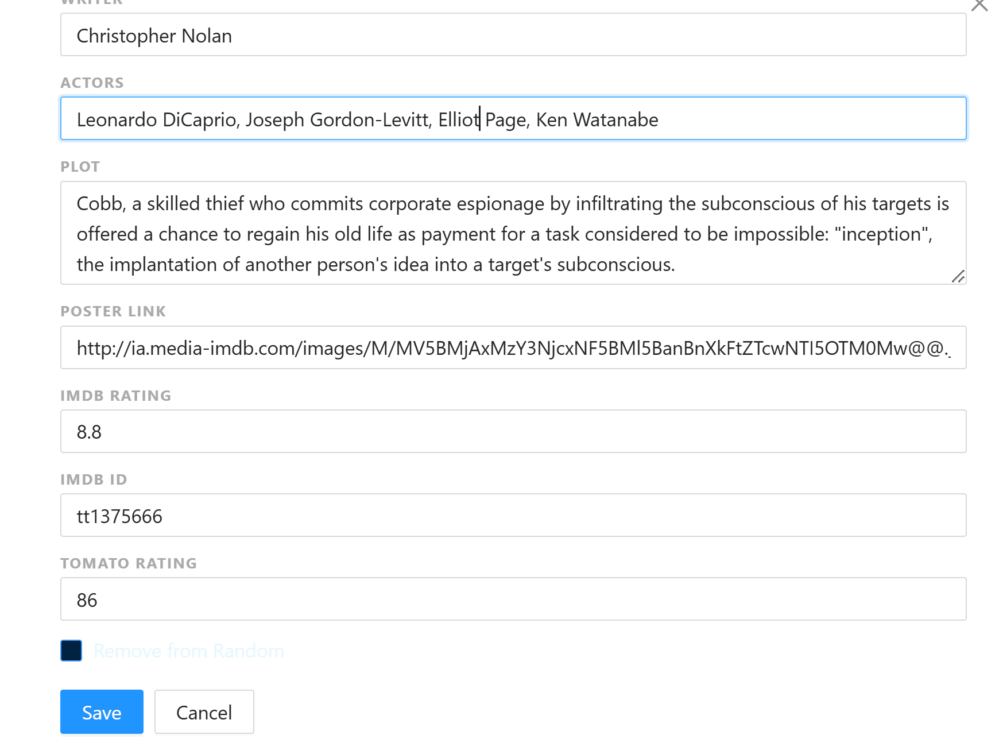
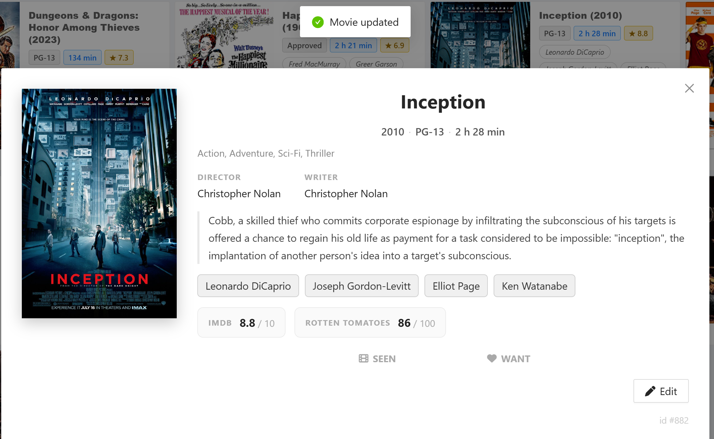
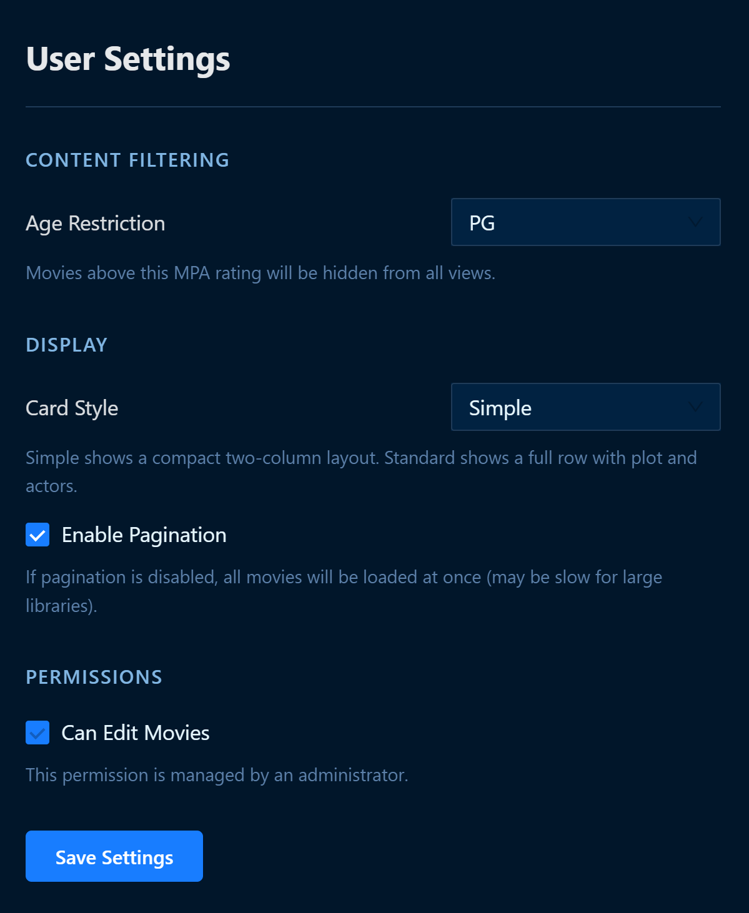
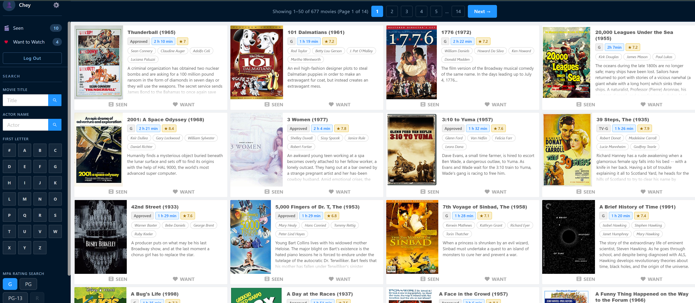

3/31-4/6/2026

- Reviewed completed tasks in Jira:
  - Edit Movie Functionality
    - User settings
    - Movie poster redownload
  - Additional movie browsing options
    - MPA Rating filter
    - Pagination
  - Dynamic Collage Functionality
    - Changed how movie posters are stored
    - Gather average color (hex color) for each poster
  - Image Caching
    - Browser cache

- New database table: MoviePosterDetails
  - PosterVersion column > for updated posters
  - DominateColor column > to store hex color for each poster

Current Issue on my machine: Broken Image

Updated Features:

