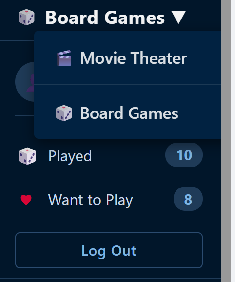
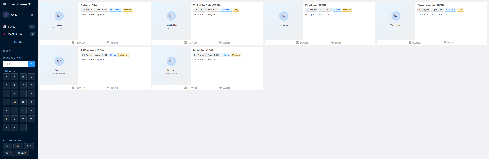
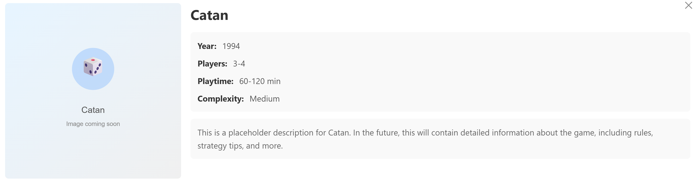
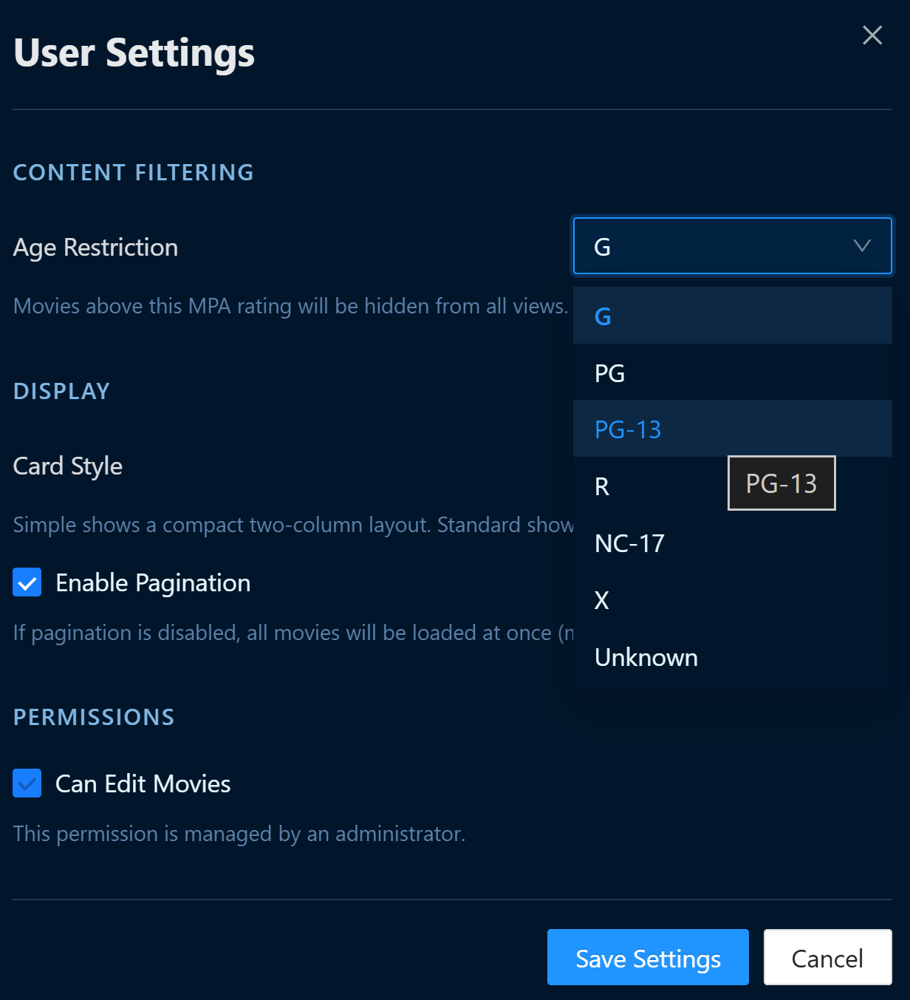
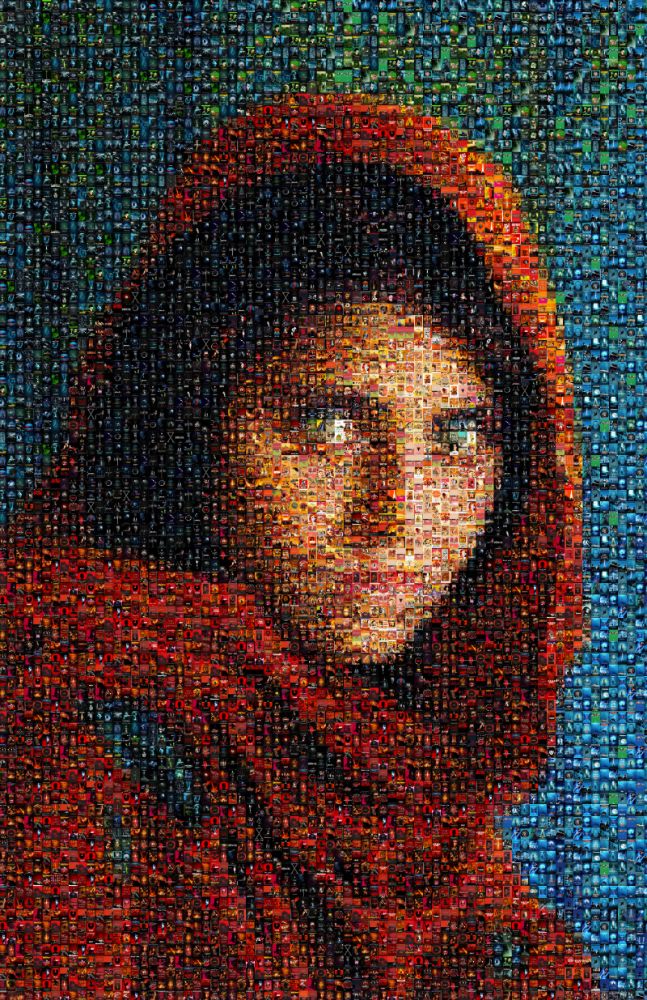
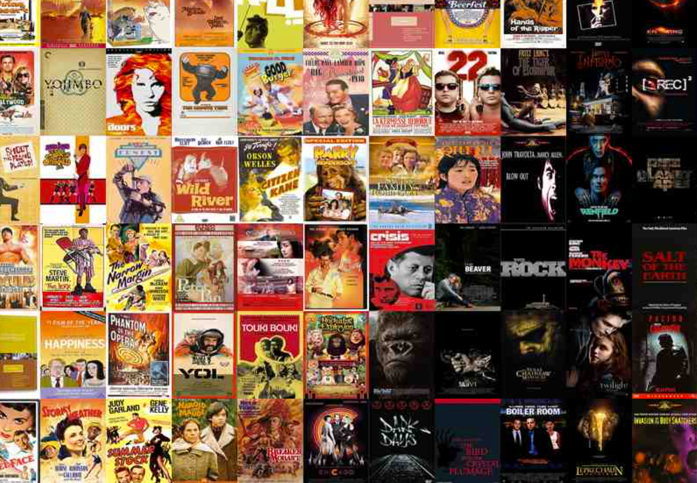

4/7-13/2026

- Reviewed API/InsertMovie method and other associated endpoints to research how to add new feature: Request to Add movie
  -  APIs, batch inserts, duplicate detection, title normalization, poster processing, error handling

## Meeting Notes
Met with Eric on Wednesday 4/8/26, Saturday 4/11/26, and Monday 4/13/26
- Fixed local modals not downloading posters > was showing broken images due to caching issue
- Discussed capturing datetime for all entries in table
  - Will be used to list 'seen' entries and other filtering
- Mosaic feature has been updated > available using Postman
  - Need to reconsider:
    - Weight of each poster used per mosaic
    - Distance of each repeated poster per mosaic
    - Give control of how many posters and size of each poster is shown in final image
    - Control filter for which posters can be used
- I provided notes on how to achieve 'Request to Add' feature leveraging existing insert logic
    - Create new database table to store pending requests
    - Create appropriate endpoints, especially for posters
    - Consider Admin approval of requests before movies are added
- Edit function works, but we need to still keep track of any changes for now
  
### Commits > Frontend:
- Updated frontend, including mobile styling, to be consistent throughout
  - Edit page, movie card modals, nav bar elements, user settings
  - Addressed "sticky hover" of highlighted words on mobile site
- Updated User Settings to be a popup window instead of a separate page
  - Mobile site allows popup over nav sidebar
- Began adding a new section for Board Games, starting with UI 
  - Made it a dropdown from current 'Movie Theater' title
  - Kept the elements and styling consistent with Movie section, but altered the content to match the media type
  - User Settings is not updated yet
  - Added placeholder poster images until we connect with database and backend

Board Game section:

Current frontend style:

Mosaic refinement:

