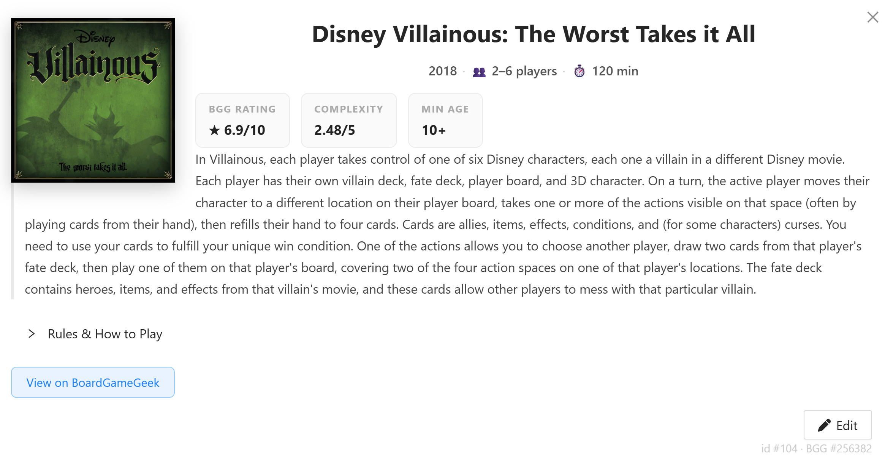
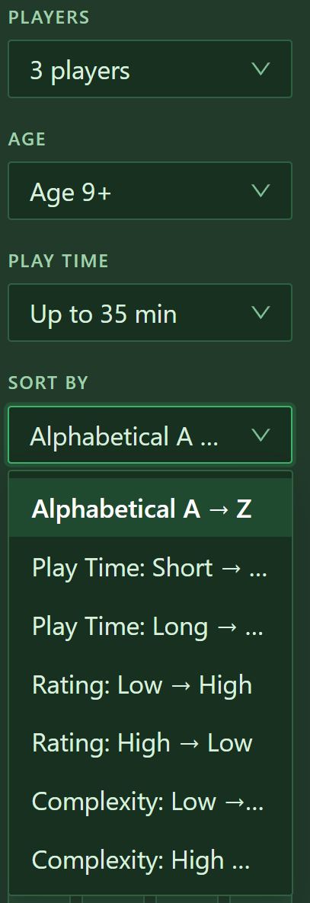
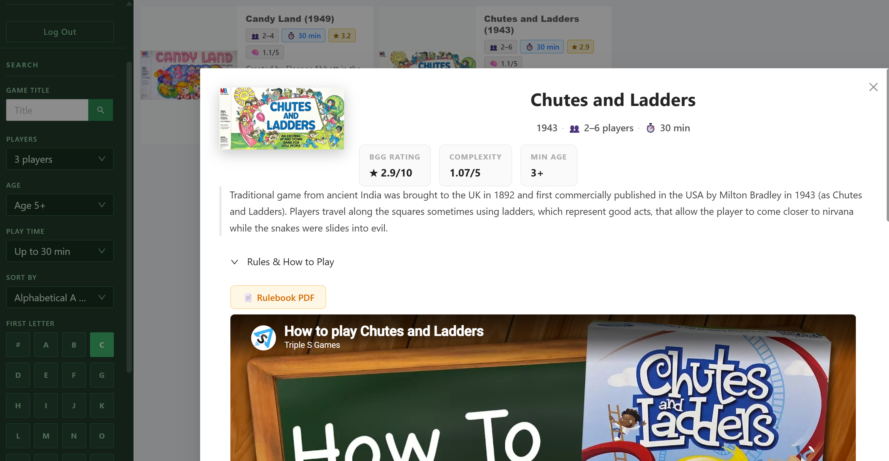

4/14-20/2026

- Utilized functions and features from movie section to configure board game section
- Designed and implements a database of board games, structured based on Board Game Geek (BGG) in order to use their API

## Meeting Notes
Met with Eric on Tuesday 4/14/26 and Friday 4/17/26
- Discussed potentially naming/renaming the website, especially for my project name, but we will keep it generic for now
- Updated board game section using BGG API
  - UI styling 
  - Edit functionality works > includes an option to enter a BGG ID and it'll swap out the details
  - Gametime is now a range
  - Filter by: Player Count, Age, Play Time
  - Sort by: Alphabetical, Complexity 
- Google API is restricting the search API so you can no longer do full-web searches, we'll need to get smart to think of a way to bot around that
- Found reference for summary rules & player reference sheets: https://www.orderofgamers.com/games/ “The Esoteric Order of Gamers”
- How-To-Play videos have been added for most games so far

### Board Game section:

