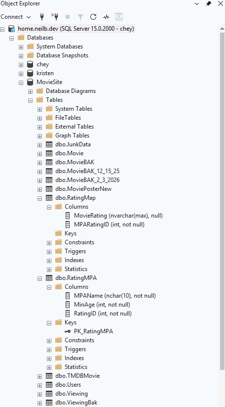
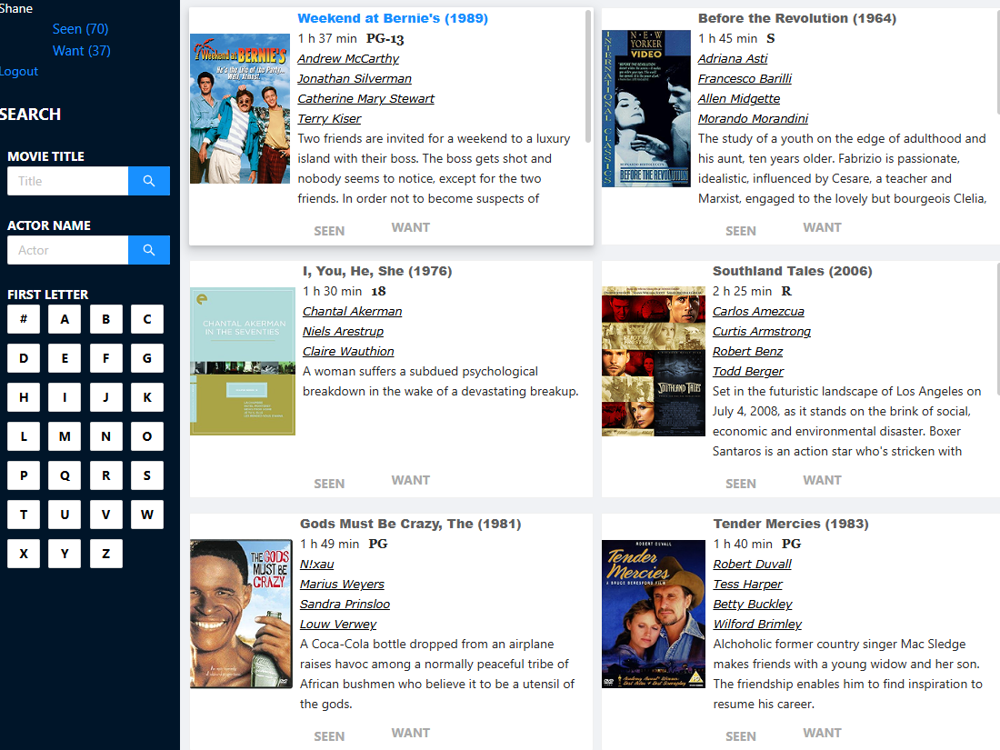
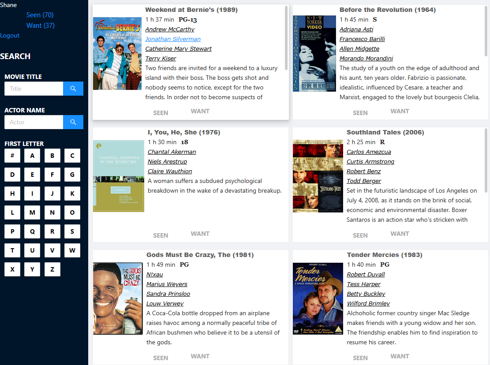
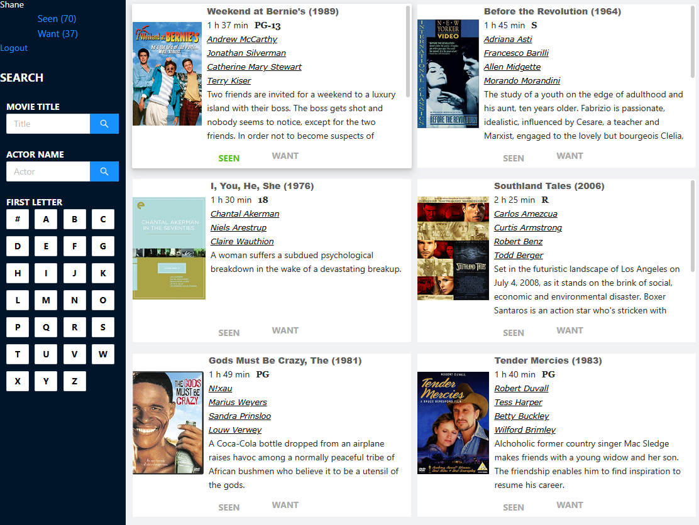
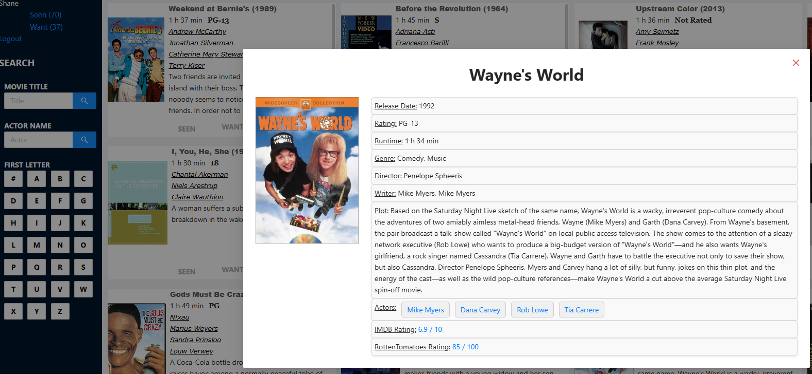
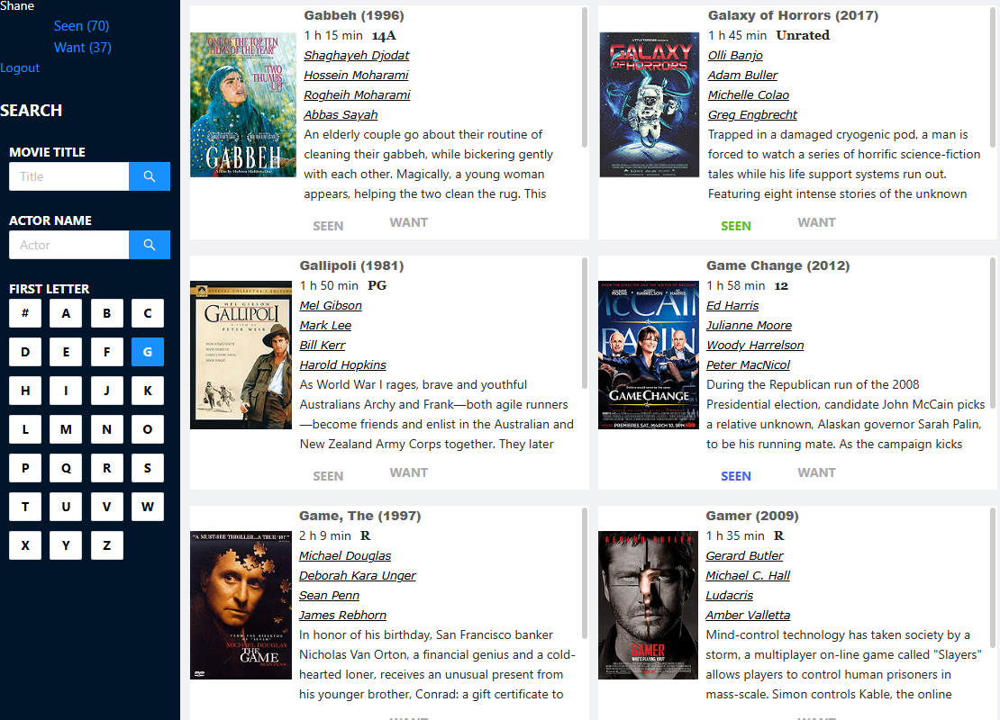
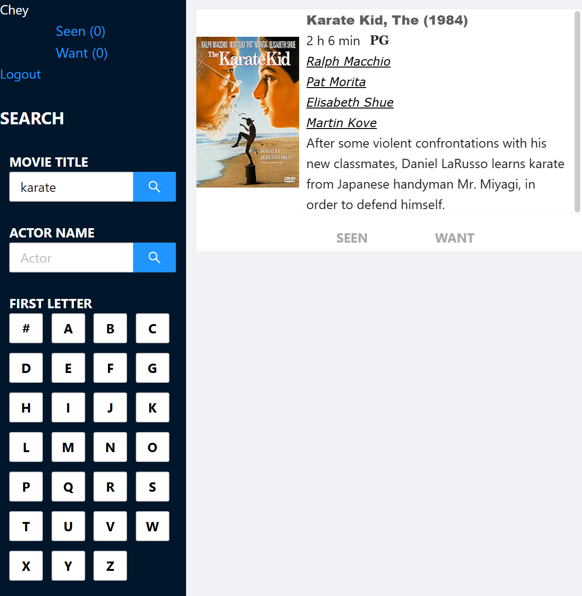
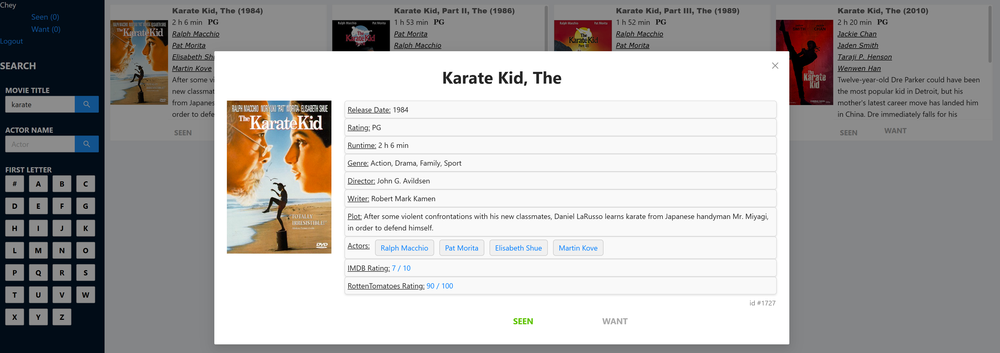

2/17-23/2026

 - Added GitLens to VSCode to graphically view repository history
- Learned how to Stash code / Apply from Stash / Drop Stash

## Meeting Notes
Met with Eric on Tuesday 2/17/26 
- Reviewed new Jira tickets    
    - Some tasks are blocked by others as they are more involved
- Discussed reorganizing movie ratings of each movie to better filter logic via mapping > This will be used to help hide restricted movies on the browse page as well as for certain users
    - New tables were introducted to the database schema: RatingMPA & RatingMap
    - I suggested that we use age ranges, based on known rating guidelines, as we could eventually include an age setting when creating/updating profiles
    - Next, I will be verifying movie rating age ranges to complete mapping, referencing: Motion Picture Association (MPA) & Classification and Rating Administration (CARA)

### New Database Tables:
_RatingMap & RatingMPA:_

### Commits > Frontend:
- Highlight when hovering:
    - **Movie Title** on browse page (blue)
    - **Actor Name** on browse page (blue)
    - **Seen / Want** buttons on browse page (green)
    - **Closing X** on movie card pop-up (red)
- Highlight when clicked:
    - **First Letter** on browse page (blue)
- Alignments of Seen / Want buttons
- Added movie id from database to movie card pop-up
- Added "Seen" and "Want" buttons to movie card pop-up
 

 

 

