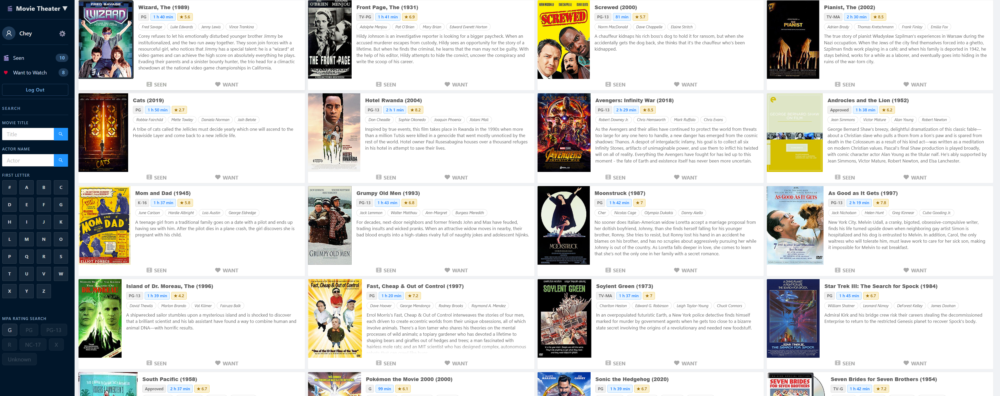
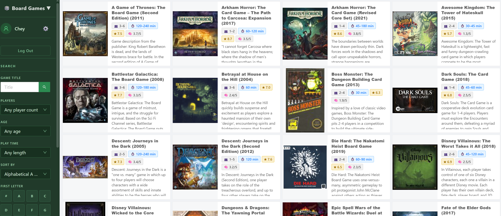
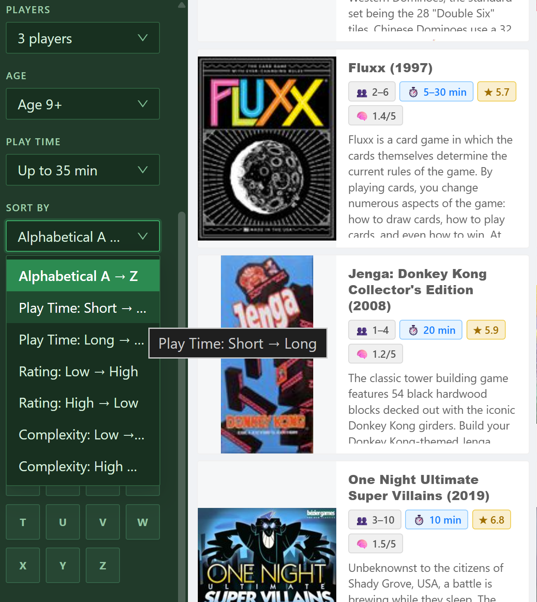

# Movie Theater Site
Senior Project, SUNY New Paltz - Spring 2026

## Link to Project

https://github.com/ecarpouzis/MovieTheater.git
- Flatbox Studios Supervisor: Eric Carpouzis

## Overview
"Movie Theater" iis a web-based app celebrating cinema & table top games, providing a solution to combat the endless options of movies to watch, everything from the classics to streaming media, and decide which board games to play off your shelf. This site tracks seen movies and want-to-watch movies and helps narrow down board game details, allowing for more personalized activity-based gatherings!

# Movie Features
- Users
    - Discover friend’s lists, set age restrictions according to MPA ratings, and customize view style on mobile site
    
- Movies & Actors
    - Search capabilities via alphabet list for movie titles and search bars for movie titles and actor names
    - Links to IMDb and RottenTomatoes ratings

- Seen
    - Once logged in, a user can mark each movie they've seen, updating the number of movies they've watched from the collection, and view the full 'seen' list

- Want	
    - Similar to the above 'seen' feature, but used for movies you want to watch in the future

- Posters
    - The site can generate one massive collage of all movie posters or movies from a specific actor
 
### Movie Collection References
- 1001 Movies To Watch Before You Die
- National Film Registry (Library of Congress)
- The Criterion Collection

# Board Game Features
- Board Games
    - Search capabilities via alphabet list for board game titles and search bars for board game titles and additional filters
    - How-to-Play video links
    - Link to BoardGameGeek

- Filters
    - Player count, player age, and play length
 
- Sorting
    - Alphabetical, play time, rating, and complexity     
      

### Future Features:
Movies:
- Personalized movie ratings
- Request movies to add to site 
- Trailers for movies
- Streaming services available per movie
- Scheduler for movies nights

Games:
- Tags for type of games for better filtering
- Rule books and Icon References
- Scheduler for game nights

## Technical Stack
Movie Theater Site is an open-source .NET entity-management application leveraging open APIs, such as Google’s Programmable Search Engine API, with a front-end driven by React.

Movie Data & Posters 
- Data has been retrieved through various methods including web scraping and API access
- Posters were once stored as BLOBs, but now stored as files because it’s faster and less resource-intensive
- When a new movie is added to the site, a Python script is run to create a high quality/small sized thumbnail, which is used when browsing for movies
Users 
- A typical ASP.Net Identity implementation would be trivial, but this site is communally shared between Flatbox Studio members and friends, with no private data

## Lanaguages & Frameworks
- Languages:
    - **C# (.NET 8)**
    - **JavaScript/JSX**
    - **Python**
    - **SQL**
  
- Backend:
    - **ASP.NET Core 8**
    - **OData**
    - **Entity Framework Core**

- Frontend:
    - **React 18**
        - **Vite**
        - **Ant Design v4**

- Database:
    - **SQL Server**

- Containerization & Deployment:
    - **Docker**
    - **MicroK8s (Kubernetes)**

- APIs:
    - **IMDb API** > movie data
    - **TMDB** > movie metadata
    - **OMDB** > movie metadata
    - **BoardGameGeek XML API 2** > board game data
    - **Google Search API** > image/search lookups

## Local Development
**Clone GitHub Repository:** https://github.com/ecarpouzis/MovieTheater.git

- Database server requires a private account & password
 
- Run commands in terminal frontend:
    - **cd src/ui**
    - **npm install --legacy-peer-deps** 
    - **npm run start**

<ins>React runs on localhost:3000</ins>

- Open Project/Solution "MovieTheater":
    - Run program

<ins>C# runs on localhost:3001</ins>
