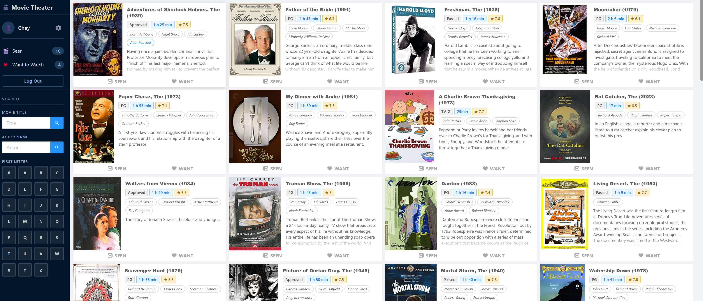
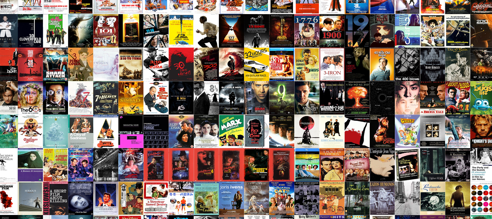
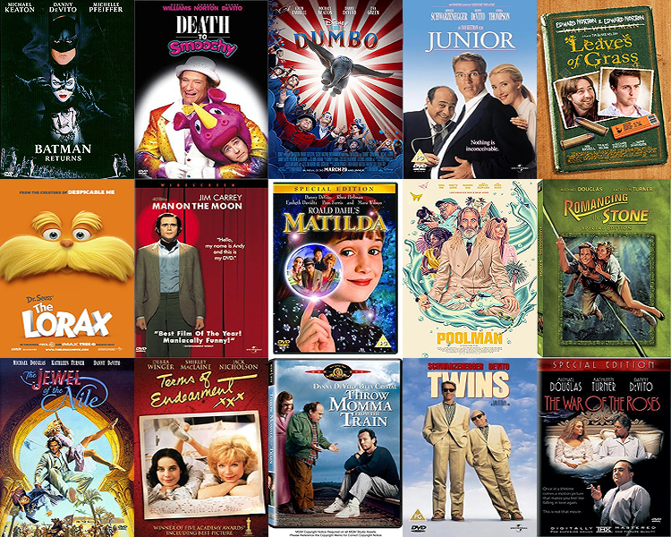

# Movie Theater Site
Senior Project, SUNY New Paltz - Spring 2026

## Link to Project

https://github.com/ecarpouzis/MovieTheater.git
- Flatbox Studios Supervisor: Eric Carpouzis

## Overview
"Movie Theater" is a web-based app celebrating cinema and providing a solution to combat the endless options of movies from everything between the classics and the world of streaming-services. This site tracks seen movies and want-to-watch movies to assist with planning stress-free movie nights! 

# Features
- Users
    - Discover friend’s lists, set age restrictions, and customize view style
    
- Movies & Actors
    - Search capabilities via alphabet list for movie titles and search bars for movie titles and actor names

- Seen
    - Once logged in, a user can mark each movie they've seen, updating the number of movies they've watched from the collection, and view the full 'seen' list

- Want	
    - Similar to the above 'seen' feature, but used for movies you want to watch in the future

- Posters
    - The site can generate one massive collage of all movie posters or movies from a specific actor

### Future Features:
- Personalized movie ratings
- Request movies to add to site 
- Trailers for movies
- Streaming services available per movie
- Generate mosaics from movie posters

## Collection References
- 1001 Movies To Watch Before You Die
- National Film Registry (Library of Congress)
- The Criterion Collection

## Tech Stack
Movie Theater Site is an open-source .NET entity-management application leveraging open APIs, such as Google’s Programmable Search Engine API, with a front-end driven by React.

Movie Data & Posters 
- Data has been retrieved through various methods including web scraping and API access
- Posters were once stored as BLOBs, but now stored as files because it’s faster and less resource-intensive
- When a new movie is added to the site, a Python script is run to create a high quality/small sized thumbnail, which is used when browsing for movies
Users 
- A typical ASP.Net Identity implementation would be trivial, but this site is communally shared between Flatbox Studio members and friends, with no private data

## Lanaguages & Frameworks
- Backend: **ASP.NET Core 8.0 (C#)** & **Python**
    - IDE: Visual Studio 

- Frontend: **React 18.3 (JavaScript/JSX)** & **Vite 6.2**
    - IDE: Visual Studio Code

- Database: **SQL**
    - IDE: SQL Server Management Studio

- Containerization & Deployment: **Docker** & **Kubernetes** 

## Local Development
**Clone GitHub Repository:** https://github.com/ecarpouzis/MovieTheater.git

- Database server requires a private account & password

- Run commands in terminal frontend:
    - **cd src/ui**
    - **npm install --legacy-peer-deps** // installs dependencies
    - **npm run start**

<ins>React runs on localhost:3000</ins>

- Open Project/Solution "MovieTheater":
    - Run program

<ins>C# runs on localhost:3001</ins>
